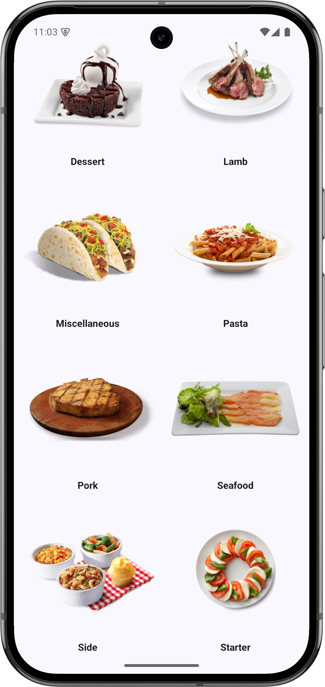
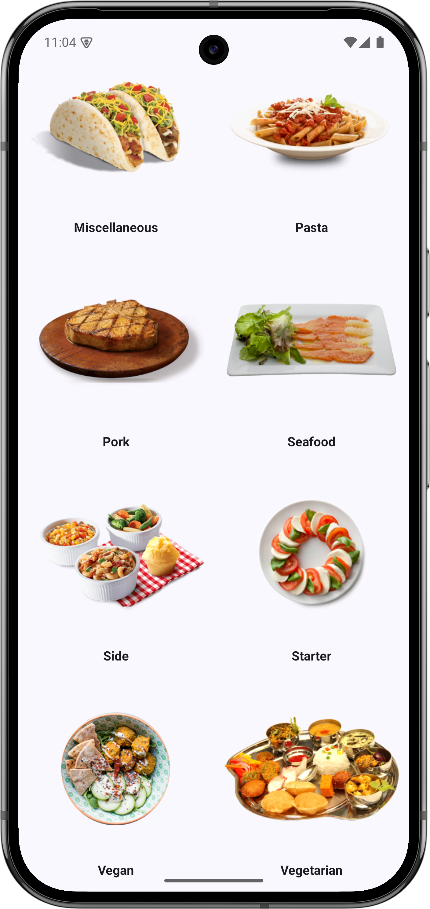
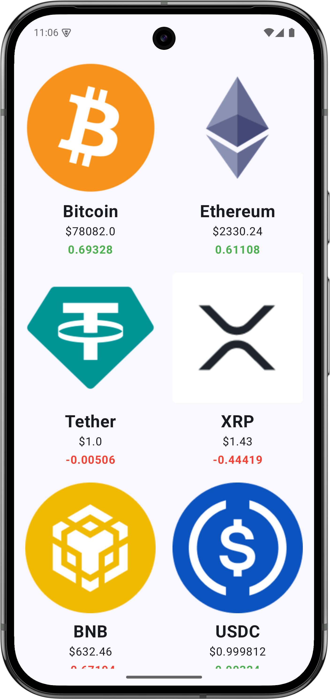
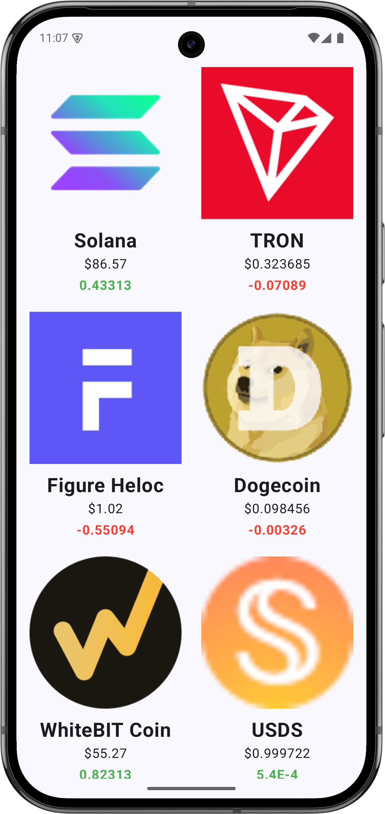

# 🚀 Dev-Playground: Android Development Showcase 📱

Welcome to the **Dev-Playground**! This repository serves as a collection of Android applications developed to explore and demonstrate modern Android development practices using **Kotlin** and **Jetpack Compose**.

[](https://github.com/rathee-dev)
[](https://github.com/rathee-dev/Dev-Playground)
[](LICENSE)

---

## 🛠 Tech Stack & Tools

- **Language:** [Kotlin](https://kotlinlang.org/) ⚡
- **UI Framework:** [Jetpack Compose](https://developer.android.com/jetpack/compose) 🎨
- **Networking:** [Retrofit](https://square.github.io/retrofit/) 🌐
- **JSON Parsing:** [Gson](https://github.com/google/gson) 📦
- **Image Loading:** [Coil](https://coil-kt.github.io/coil/) 🖼️
- **Architecture:** MVVM (Model-View-ViewModel) 🏗️
- **Concurrency:** Kotlin Coroutines & Flow 🔄

---

## 👨‍💻 Projects Overview

### 1. 🍽️ MyRecipeApp
A delightful application for culinary enthusiasts to explore various food categories and recipes from around the world. It fetches data in real-time from [TheMealDB API](https://www.themealdb.com/api.php).

**Key Features:**
- 📜 Browse diverse food categories.
- 🔍 Detailed view for each category (Ingredients & Instructions).
- ⚡ Smooth asynchronous image loading with Coil.
- 🏗️ Robust error handling and loading states.

#### 📸 Screenshots
<p align="center">
  
  
</p>

---

### 2. 📈 StockTracker (Crypto Monitor)
A real-time cryptocurrency tracking application that provides up-to-date market prices and 24-hour fluctuations using the [CoinGecko API](https://www.coingecko.com/en/api).

**Key Features:**
- 💰 Live price tracking for top cryptocurrencies.
- 📉 24-hour price change percentage with color-coded indicators (Green for Profit, Red for Loss).
- 🖼️ High-quality crypto icons fetched dynamically.
- 📱 Responsive Grid Layout for better data visualization.

#### 📸 Screenshots
<p align="center">
  
  
</p>

---

## 🚀 Getting Started

To get a local copy up and running, follow these simple steps:

1. **Clone the repo**
   ```bash
   git clone https://github.com/rathee-dev/Dev-Playground.git
   ```
2. **Open in Android Studio**
   Open the root folder or individual project folders (`MyRecipeApp` or `StockTracker`) in Android Studio (Hedgehog or newer recommended).
3. **Build & Run**
   Select your preferred device/emulator and hit the **Run** button!

---

## 🤝 Contributing

Contributions are what make the open-source community such an amazing place to learn, inspire, and create. Any contributions you make are **greatly appreciated**.

1. Fork the Project
2. Create your Feature Branch (`git checkout -b feature/AmazingFeature`)
3. Commit your Changes (`git commit -m 'Add some AmazingFeature'`)
4. Push to the Branch (`git push origin feature/AmazingFeature`)
5. Open a Pull Request

---

## 👤 Author

**Himanshu Rathee**
- GitHub: [@rathee-dev](https://github.com/rathee-dev)
- Portfolio: [Coming Soon...]

---

## 📄 License

Distributed under the MIT License. See `LICENSE` for more information.

<p align="center">Made with ❤️ and ☕ by <a href="https://github.com/rathee-dev">rathee-dev</a></p>
